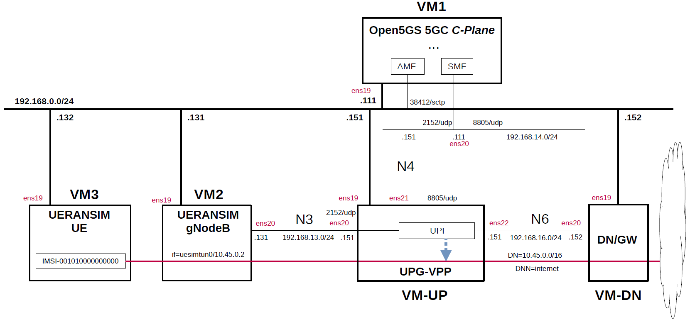

# Open5GS 5GC & UERANSIM UE / RAN Sample Configuration - VPP-UPF with DPDK
This describes a simple configuration for working Open5GS 5GC and VPP-UPF with DPDK.
In particular, see [here](https://github.com/s5uishida/install_vpp_upf_dpdk) for VPP-UPF with DPDK configuration.

---

<a id="conf_list"></a>

## List of Sample Configurations

1. [One SGW-C/PGW-C, one SGW-U/PGW-U and one APN](https://github.com/s5uishida/open5gs_epc_srsran_sample_config)
2. [One SGW-C/PGW-C, Multiple SGW-Us/PGW-Us and APNs](https://github.com/s5uishida/open5gs_epc_oai_sample_config)
3. [One SMF, one UPF and one DNN](https://github.com/s5uishida/open5gs_5gc_srsran_sample_config)
4. [One SMF, Multiple UPFs and DNNs](https://github.com/s5uishida/open5gs_5gc_ueransim_sample_config)
5. [Select nearby UPF(PGW-U) according to the connected eNodeB](https://github.com/s5uishida/open5gs_epc_srsran_nearby_upf_sample_config)
6. [Select nearby UPF according to the connected gNodeB](https://github.com/s5uishida/open5gs_5gc_ueransim_nearby_upf_sample_config)
7. [Select UPF based on S-NSSAI](https://github.com/s5uishida/open5gs_5gc_ueransim_snssai_upf_sample_config)
8. [SCP Indirect communication Model C](https://github.com/s5uishida/open5gs_5gc_ueransim_scp_model_c_sample_config)
9. [VoLTE and SMS Configuration for docker_open5gs](https://github.com/s5uishida/docker_open5gs_volte_sms_config)
10. [Monitoring Metrics with Prometheus](https://github.com/s5uishida/open5gs_5gc_ueransim_metrics_sample_config)
11. [Framed Routing](https://github.com/s5uishida/open5gs_5gc_ueransim_framed_routing_sample_config)
12. [VPP-UPF(PGW-U) with DPDK](https://github.com/s5uishida/open5gs_epc_srsran_vpp_upf_dpdk_sample_config)
13. VPP-UPF with DPDK (this article)

---

<a id="misc"></a>

## Miscellaneous Notes

- [Install MongoDB 6.0 and Open5GS WebUI](https://github.com/s5uishida/open5gs_install_mongodb6_webui)
- [Install MongoDB 4.4.18 on Ubuntu 20.04 for Raspberry Pi 4B](https://github.com/s5uishida/install_mongodb_on_ubuntu_for_rp4b)
- [A Note for 5G SUCI Profile A/B Scheme](https://github.com/s5uishida/note_5g_suci_profile_ab)
- [Install VPP-UPF with DPDK on Host](https://github.com/s5uishida/install_vpp_upf_dpdk)

---

<a id="toc"></a>

## Table of Contents

- [Overview of Open5GS 5GC Simulation Mobile Network](#overview)
- [Changes in configuration files of Open5GS 5GC, VPP-UPF and UERANSIM UE / RAN](#changes)
  - [Changes in configuration files of Open5GS 5GC C-Plane](#changes_cp)
  - [Changes in configuration files of VPP-UPF](#changes_up)
  - [Changes in configuration files of UERANSIM UE / RAN](#changes_ueransim)
    - [Changes in configuration files of RAN](#changes_ran)
    - [Changes in configuration files of UE (IMSI-001010000000000)](#changes_ue)
- [Network settings of Open5GS 5GC, VPP-UPF and UERANSIM UE / RAN](#network_settings)
  - [Network settings of VPP-UPF and Data Network Gateway](#network_settings_up)
- [Build Open5GS, VPP-UPF and UERANSIM](#build)
- [Run Open5GS 5GC, VPP-UPF and UERANSIM UE / RAN](#run)
  - [Run VPP-UPF](#run_up)
  - [Run Open5GS 5GC C-Plane](#run_cp)
  - [Run UERANSIM](#run_ueran)
    - [Start gNB](#start_gnb)
    - [Start UE](#start_ue)
- [Ping google.com](#ping)
  - [Case for going through DN 10.45.0.0/16](#ping_1)
- [Changelog (summary)](#changelog)

---

<a id="overview"></a>

## Overview of Open5GS 5GC Simulation Mobile Network

This describes a simple configuration of C-Plane, VPP-UPF and Data Network Gateway for Open5GS 5GC.
**Note that this configuration is implemented with Virtualbox VMs.**

The following minimum configuration was set as a condition.
- One UPF and Data Network Gateway
- One UE and one DNN

The built simulation environment is as follows.

</img>

The 5GC / VPP-UPF / UE / RAN used are as follows.
- 5GC - Open5GS v2.6.4 (2023.06.14) - https://github.com/open5gs/open5gs
- VPP-UPF - OpenAir CN 5G for UPF v1.5.1 (2023.05.15) - https://gitlab.eurecom.fr/oai/cn5g/oai-cn5g-upf-vpp
- UE / RAN - UERANSIM v3.2.6 (2023.06.14) - https://github.com/aligungr/UERANSIM

Each VMs are as follows.  
| VM | SW & Role | IP address | OS | CPU<br>(Min) | Memory<br>(Min) | HDD<br>(Min) |
| --- | --- | --- | --- | --- | --- | --- |
| VM1 | Open5GS 5GC C-Plane | 192.168.0.111/24 | Ubuntu 22.04 | 1 | 1GB | 20GB |
| VM-UP | OpenAir CN 5G for UPF | 192.168.0.151/24 | Ubuntu 22.04 | 2 | 8GB | 20GB |
| VM-DN | Data Network Gateway  | 192.168.0.152/24 | Ubuntu 22.04 | 1 | 1GB | 10GB |
| VM2 | UERANSIM RAN (gNodeB) | 192.168.0.131/24 | Ubuntu 22.04 | 1 | 1GB | 10GB |
| VM3 | UERANSIM UE | 192.168.0.132/24 | Ubuntu 22.04 | 1 | 1GB | 10GB |

The network interfaces of each VM are as follows.
**Note. Do not enable(up) any devices that will be under the control of DPDK.
These devices will be enabled and set IP addresses in the `init.conf` file of VPP-UPF.**
| VM | Device | Network Adapter | IP address | Interface | Under DPDK |
| --- | --- | --- | --- | --- | --- |
| VM1 | enp0s3 | NAT(default) | 10.0.2.15/24 | (VM default NW) | -- |
| | enp0s8 | Bridged Adapter | 192.168.0.111/24 | (Mgmt NW) | -- |
| | enp0s9 | NAT Network | 192.168.14.111/24 | N4 | -- |
| VM-UP | enp0s3 | NAT(default) | 10.0.2.15/24 | (VM default NW) | -- |
| | enp0s8 | Bridged Adapter | 192.168.0.151/24 | (Mgmt NW) | -- |
| | enp0s9 | NAT Network | 192.168.13.151/24 | N3 | x |
| | enp0s10 | NAT Network | 192.168.14.151/24 | N4 | x |
| | enp0s16 | NAT Network | 192.168.16.151/24 | N6 | x |
| VM-DN | enp0s3 | NAT(default) | 10.0.2.15/24 | (VM default NW) | -- |
| | enp0s8 | Bridged Adapter | 192.168.0.152/24 | (Mgmt NW) | -- |
| | enp0s9 | NAT Network | 192.168.16.152/24 | N6 | -- |
| VM2 | enp0s3 | NAT(default) | 10.0.2.15/24 | (VM default NW) | -- |
| | enp0s8 | Bridged Adapter | 192.168.0.131/24 | (Mgmt NW) | -- |
| | enp0s9 | NAT Network | 192.168.13.131/24 | N3 | -- |
| VM3 | enp0s3 | NAT(default) | 10.0.2.15/24 | (VM default NW) | -- |
| | enp0s8 | Bridged Adapter | 192.168.0.132/24 | (Mgmt NW) | -- |

NAT networks of Virtualbox  are as follows.
| Network Name | Network CIDR |
| --- | --- |
| N3 | 192.168.13.0/24 |
| N4 | 192.168.14.0/24 |
| N6 | 192.168.16.0/24 |

Set network instance to `internet`.
| Network Instance |
| --- |
| internet |

Subscriber Information (other information is the same) is as follows.  
**Note. Please select OP or OPc according to the setting of UERANSIM UE configuration file.**
| UE | IMSI | DNN | OP/OPc |
| --- | --- | --- | --- |
| UE | 001010000000000 | internet | OPc |

I registered these information with the Open5GS WebUI.
In addition, [3GPP TS 35.208](https://www.3gpp.org/DynaReport/35208.htm) "4.3 Test Sets" is published by 3GPP as test data for the 3GPP authentication and key generation functions (MILENAGE).

The DN is as follows.
| DN | DNN | TUNnel interface of UE |
| --- | --- | --- |
| 10.45.0.0/16 | internet | uesimtun0 |

<a id="changes"></a>

## Changes in configuration files of Open5GS 5GC, VPP-UPF and UERANSIM UE / RAN

Please refer to the following for building Open5GS, VPP-UPF and UERANSIM respectively.
- Open5GS v2.6.4 (2023.06.14) - https://open5gs.org/open5gs/docs/guide/02-building-open5gs-from-sources/
- OpenAir CN 5G for UPF v1.5.1 (2023.05.15) - https://github.com/s5uishida/install_vpp_upf_dpdk
- UERANSIM v3.2.6 (2023.06.14) - https://github.com/aligungr/UERANSIM/wiki/Installation

<a id="changes_cp"></a>

### Changes in configuration files of Open5GS 5GC C-Plane

The following parameters including DNN can be used in the logic that selects UPF as the connection destination by PFCP.

- DNN
- TAC (Tracking Area Code)
- nr_CellID

For the sake of simplicity, I used only DNN this time. Please refer to [here](https://github.com/open5gs/open5gs/pull/560#issue-483001043) for the logic to select UPF.

- `open5gs/install/etc/open5gs/amf.yaml`
```diff
--- amf.yaml.orig       2023-06-15 21:34:19.913862330 +0900
+++ amf.yaml    2023-06-15 21:36:01.887014131 +0900
@@ -474,26 +474,26 @@
       - addr: 127.0.0.5
         port: 7777
     ngap:
-      - addr: 127.0.0.5
+      - addr: 192.168.0.111
     metrics:
       - addr: 127.0.0.5
         port: 9090
     guami:
       - plmn_id:
-          mcc: 999
-          mnc: 70
+          mcc: 001
+          mnc: 01
         amf_id:
           region: 2
           set: 1
     tai:
       - plmn_id:
-          mcc: 999
-          mnc: 70
+          mcc: 001
+          mnc: 01
         tac: 1
     plmn_support:
       - plmn_id:
-          mcc: 999
-          mnc: 70
+          mcc: 001
+          mnc: 01
         s_nssai:
           - sst: 1
     security:
```
- `open5gs/install/etc/open5gs/smf.yaml`
```diff
--- smf.yaml.orig       2023-06-15 21:34:19.886859373 +0900
+++ smf.yaml    2023-06-15 21:36:14.354599217 +0900
@@ -602,25 +602,20 @@
       - addr: 127.0.0.4
         port: 7777
     pfcp:
-      - addr: 127.0.0.4
-      - addr: ::1
+      - addr: 192.168.14.111
     gtpc:
       - addr: 127.0.0.4
-      - addr: ::1
     gtpu:
-      - addr: 127.0.0.4
-      - addr: ::1
+      - addr: 192.168.14.111
     metrics:
       - addr: 127.0.0.4
         port: 9090
     subnet:
       - addr: 10.45.0.1/16
-      - addr: 2001:db8:cafe::1/48
+        dnn: internet
     dns:
       - 8.8.8.8
       - 8.8.4.4
-      - 2001:4860:4860::8888
-      - 2001:4860:4860::8844
     mtu: 1400
     ctf:
       enabled: auto
@@ -808,7 +803,8 @@
 #
 upf:
     pfcp:
-      - addr: 127.0.0.7
+      - addr: 192.168.14.151
+        dnn: internet
 
 #
 #  o Disable use of IPv4 addresses (only IPv6)
```

<a id="changes_up"></a>

### Changes in configuration files of VPP-UPF

See [here](https://github.com/s5uishida/install_vpp_upf_dpdk#create-configuration-files) for the original files.

- `openair-upf/startup.conf`  
There is no change.

- `openair-upf/init.conf`  
There is no change.

<a id="changes_ueransim"></a>

### Changes in configuration files of UERANSIM UE / RAN

<a id="changes_ran"></a>

#### Changes in configuration files of RAN

- `UERANSIM/config/open5gs-gnb.yaml`
```diff
--- open5gs-gnb.yaml.orig       2022-07-03 13:06:44.000000000 +0900
+++ open5gs-gnb.yaml    2023-06-18 21:25:34.307164598 +0900
@@ -1,17 +1,17 @@
-mcc: '999'          # Mobile Country Code value
-mnc: '70'           # Mobile Network Code value (2 or 3 digits)
+mcc: '001'          # Mobile Country Code value
+mnc: '01'           # Mobile Network Code value (2 or 3 digits)
 
 nci: '0x000000010'  # NR Cell Identity (36-bit)
 idLength: 32        # NR gNB ID length in bits [22...32]
 tac: 1              # Tracking Area Code
 
-linkIp: 127.0.0.1   # gNB's local IP address for Radio Link Simulation (Usually same with local IP)
-ngapIp: 127.0.0.1   # gNB's local IP address for N2 Interface (Usually same with local IP)
-gtpIp: 127.0.0.1    # gNB's local IP address for N3 Interface (Usually same with local IP)
+linkIp: 192.168.0.131   # gNB's local IP address for Radio Link Simulation (Usually same with local IP)
+ngapIp: 192.168.0.131   # gNB's local IP address for N2 Interface (Usually same with local IP)
+gtpIp: 192.168.13.131    # gNB's local IP address for N3 Interface (Usually same with local IP)
 
 # List of AMF address information
 amfConfigs:
-  - address: 127.0.0.5
+  - address: 192.168.0.111
     port: 38412
 
 # List of supported S-NSSAIs by this gNB
```

<a id="changes_ue"></a>

#### Changes in configuration files of UE (IMSI-001010000000000)

- `UERANSIM/config/open5gs-ue.yaml`
```diff
--- open5gs-ue.yaml.orig        2023-05-10 19:00:38.000000000 +0900
+++ open5gs-ue.yaml     2023-06-15 21:42:14.363706123 +0900
@@ -1,9 +1,9 @@
 # IMSI number of the UE. IMSI = [MCC|MNC|MSISDN] (In total 15 digits)
-supi: 'imsi-999700000000001'
+supi: 'imsi-001010000000000'
 # Mobile Country Code value of HPLMN
-mcc: '999'
+mcc: '001'
 # Mobile Network Code value of HPLMN (2 or 3 digits)
-mnc: '70'
+mnc: '01'
 # SUCI Protection Scheme : 0 for Null-scheme, 1 for Profile A and 2 for Profile B
 protectionScheme: 0
 # Home Network Public Key for protecting with SUCI Profile A
@@ -28,7 +28,7 @@
 
 # List of gNB IP addresses for Radio Link Simulation
 gnbSearchList:
-  - 127.0.0.1
+  - 192.168.0.131
 
 # UAC Access Identities Configuration
 uacAic:
```

<a id="network_settings"></a>

## Network settings of Open5GS 5GC, VPP-UPF and UERANSIM UE / RAN

<a id="network_settings_up"></a>

### Network settings of VPP-UPF and Data Network Gateway

See [this1](https://github.com/s5uishida/install_vpp_upf_dpdk#setup-vpp-upf-with-dpdk-on-vm-up) and [this2](https://github.com/s5uishida/install_vpp_upf_dpdk#setup-data-network-gateway-on-vm-dn).

<a id="build"></a>

## Build Open5GS, VPP-UPF and UERANSIM

Please refer to the following for building Open5GS, VPP-UPF and UERANSIM respectively.
- Open5GS v2.6.4 (2023.06.14) - https://open5gs.org/open5gs/docs/guide/02-building-open5gs-from-sources/
- OpenAir CN 5G for UPF v1.5.1 (2023.05.15) - https://github.com/s5uishida/install_vpp_upf_dpdk
- UERANSIM v3.2.6 (2023.06.14) - https://github.com/aligungr/UERANSIM/wiki/Installation

Install MongoDB on Open5GS 5GC C-Plane machine.
[MongoDB Compass](https://www.mongodb.com/products/compass) is a convenient tool to look at the MongoDB database.

<a id="run"></a>

## Run Open5GS 5GC, VPP-UPF and UERANSIM UE / RAN

First run VPP-UPF, then the 5GC and UERANSIM (UE & RAN implementation).

<a id="run_up"></a>

### Run VPP-UPF

See [this](https://github.com/s5uishida/install_vpp_upf_dpdk#run-vpp-upf-with-dpdk-on-vm-up).

<a id="run_cp"></a>

### Run Open5GS 5GC C-Plane

```
./install/bin/open5gs-nrfd &
sleep 2
./install/bin/open5gs-scpd &
sleep 2
./install/bin/open5gs-amfd &
sleep 2
./install/bin/open5gs-smfd &
./install/bin/open5gs-ausfd &
./install/bin/open5gs-udmd &
./install/bin/open5gs-udrd &
./install/bin/open5gs-pcfd &
./install/bin/open5gs-nssfd &
./install/bin/open5gs-bsfd &
```

The status of PFCP association between VPP-UPF and Open5GS SMF is as follows.
```
vpp# show upf association 
Node: 192.168.14.111
  Recovery Time Stamp: 2023/06/18 22:26:01:000
  Sessions: 0
vpp#
```

<a id="run_ueran"></a>

### Run UERANSIM

Here, the case of UE (IMSI-001010000000000) & RAN is described.
First, do an NG Setup between gNodeB and 5GC, then register the UE with 5GC and establish a PDU session.

Please refer to the following for usage of UERANSIM.

https://github.com/aligungr/UERANSIM/wiki/Usage

<a id="start_gnb"></a>

#### Start gNB

Start gNB as follows.
```
# ./nr-gnb -c ../config/open5gs-gnb.yaml
UERANSIM v3.2.6
[2023-06-18 22:27:02.521] [sctp] [info] Trying to establish SCTP connection... (192.168.0.111:38412)
[2023-06-18 22:27:02.524] [sctp] [info] SCTP connection established (192.168.0.111:38412)
[2023-06-18 22:27:02.524] [sctp] [debug] SCTP association setup ascId[14]
[2023-06-18 22:27:02.524] [ngap] [debug] Sending NG Setup Request
[2023-06-18 22:27:02.525] [ngap] [debug] NG Setup Response received
[2023-06-18 22:27:02.525] [ngap] [info] NG Setup procedure is successful
```
The Open5GS C-Plane log when executed is as follows.
```
06/18 22:27:02.506: [amf] INFO: gNB-N2 accepted[192.168.0.131]:55952 in ng-path module (../src/amf/ngap-sctp.c:113)
06/18 22:27:02.507: [amf] INFO: gNB-N2 accepted[192.168.0.131] in master_sm module (../src/amf/amf-sm.c:741)
06/18 22:27:02.507: [amf] INFO: [Added] Number of gNBs is now 1 (../src/amf/context.c:1178)
06/18 22:27:02.507: [amf] INFO: gNB-N2[192.168.0.131] max_num_of_ostreams : 10 (../src/amf/amf-sm.c:780)
```

<a id="start_ue"></a>

#### Start UE

Start UE as follows. This will register the UE with 5GC and establish a PDU session.
```
# ./nr-ue -c ../config/open5gs-ue.yaml
UERANSIM v3.2.6
[2023-06-18 22:29:40.222] [nas] [info] UE switches to state [MM-DEREGISTERED/PLMN-SEARCH]
[2023-06-18 22:29:40.223] [rrc] [debug] New signal detected for cell[1], total [1] cells in coverage
[2023-06-18 22:29:40.223] [nas] [info] Selected plmn[001/01]
[2023-06-18 22:29:40.224] [rrc] [info] Selected cell plmn[001/01] tac[1] category[SUITABLE]
[2023-06-18 22:29:40.224] [nas] [info] UE switches to state [MM-DEREGISTERED/PS]
[2023-06-18 22:29:40.224] [nas] [info] UE switches to state [MM-DEREGISTERED/NORMAL-SERVICE]
[2023-06-18 22:29:40.224] [nas] [debug] Initial registration required due to [MM-DEREG-NORMAL-SERVICE]
[2023-06-18 22:29:40.226] [nas] [debug] UAC access attempt is allowed for identity[0], category[MO_sig]
[2023-06-18 22:29:40.227] [nas] [debug] Sending Initial Registration
[2023-06-18 22:29:40.227] [rrc] [debug] Sending RRC Setup Request
[2023-06-18 22:29:40.227] [nas] [info] UE switches to state [MM-REGISTER-INITIATED]
[2023-06-18 22:29:40.227] [rrc] [info] RRC connection established
[2023-06-18 22:29:40.228] [rrc] [info] UE switches to state [RRC-CONNECTED]
[2023-06-18 22:29:40.228] [nas] [info] UE switches to state [CM-CONNECTED]
[2023-06-18 22:29:40.235] [nas] [debug] Authentication Request received
[2023-06-18 22:29:40.240] [nas] [debug] Security Mode Command received
[2023-06-18 22:29:40.240] [nas] [debug] Selected integrity[2] ciphering[0]
[2023-06-18 22:29:40.254] [nas] [debug] Registration accept received
[2023-06-18 22:29:40.254] [nas] [info] UE switches to state [MM-REGISTERED/NORMAL-SERVICE]
[2023-06-18 22:29:40.254] [nas] [debug] Sending Registration Complete
[2023-06-18 22:29:40.254] [nas] [info] Initial Registration is successful
[2023-06-18 22:29:40.254] [nas] [debug] Sending PDU Session Establishment Request
[2023-06-18 22:29:40.254] [nas] [debug] UAC access attempt is allowed for identity[0], category[MO_sig]
[2023-06-18 22:29:40.458] [nas] [debug] Configuration Update Command received
[2023-06-18 22:29:40.479] [nas] [debug] PDU Session Establishment Accept received
[2023-06-18 22:29:40.484] [nas] [info] PDU Session establishment is successful PSI[1]
[2023-06-18 22:29:40.508] [app] [info] Connection setup for PDU session[1] is successful, TUN interface[uesimtun0, 10.45.0.2] is up.
```
The Open5GS C-Plane log when executed is as follows.
```
06/18 22:29:40.192: [amf] INFO: InitialUEMessage (../src/amf/ngap-handler.c:372)
06/18 22:29:40.192: [amf] INFO: [Added] Number of gNB-UEs is now 1 (../src/amf/context.c:2502)
06/18 22:29:40.192: [amf] INFO:     RAN_UE_NGAP_ID[1] AMF_UE_NGAP_ID[1] TAC[1] CellID[0x10] (../src/amf/ngap-handler.c:533)
06/18 22:29:40.192: [amf] INFO: [suci-0-001-01-0000-0-0-0000000000] Unknown UE by SUCI (../src/amf/context.c:1776)
06/18 22:29:40.192: [amf] INFO: [Added] Number of AMF-UEs is now 1 (../src/amf/context.c:1563)
06/18 22:29:40.192: [gmm] INFO: Registration request (../src/amf/gmm-sm.c:985)
06/18 22:29:40.192: [gmm] INFO: [suci-0-001-01-0000-0-0-0000000000]    SUCI (../src/amf/gmm-handler.c:152)
06/18 22:29:40.194: [sbi] WARNING: [aad249e2-0ddb-41ee-970a-612fd8d093f3] (NF-discover) NF has already been added (../lib/sbi/nnrf-handler.c:833)
06/18 22:29:40.195: [sbi] WARNING: NF EndPoint updated [127.0.0.12:80] (../lib/sbi/context.c:1623)
06/18 22:29:40.195: [sbi] WARNING: NF EndPoint updated [127.0.0.12:7777] (../lib/sbi/context.c:1532)
06/18 22:29:40.195: [sbi] WARNING: NF EndPoint updated [127.0.0.12:7777] (../lib/sbi/context.c:1532)
06/18 22:29:40.195: [sbi] WARNING: NF EndPoint updated [127.0.0.12:7777] (../lib/sbi/context.c:1532)
06/18 22:29:40.195: [sbi] INFO: [aad249e2-0ddb-41ee-970a-612fd8d093f3] (NF-discover) NF Profile updated (../lib/sbi/nnrf-handler.c:856)
06/18 22:29:40.214: [sbi] WARNING: [aad9122c-0ddb-41ee-8a34-472da38afdc3] (NF-discover) NF has already been added (../lib/sbi/nnrf-handler.c:833)
06/18 22:29:40.215: [sbi] WARNING: NF EndPoint updated [127.0.0.20:80] (../lib/sbi/context.c:1623)
06/18 22:29:40.215: [sbi] WARNING: NF EndPoint updated [127.0.0.20:7777] (../lib/sbi/context.c:1532)
06/18 22:29:40.215: [sbi] INFO: [aad9122c-0ddb-41ee-8a34-472da38afdc3] (NF-discover) NF Profile updated (../lib/sbi/nnrf-handler.c:856)
06/18 22:29:40.421: [gmm] INFO: [imsi-001010000000000] Registration complete (../src/amf/gmm-sm.c:1917)
06/18 22:29:40.422: [amf] INFO: [imsi-001010000000000] Configuration update command (../src/amf/nas-path.c:612)
06/18 22:29:40.422: [gmm] INFO:     UTC [2023-06-18T13:29:40] Timezone[0]/DST[0] (../src/amf/gmm-build.c:546)
06/18 22:29:40.422: [gmm] INFO:     LOCAL [2023-06-18T22:29:40] Timezone[32400]/DST[0] (../src/amf/gmm-build.c:551)
06/18 22:29:40.422: [amf] INFO: [Added] Number of AMF-Sessions is now 1 (../src/amf/context.c:2523)
06/18 22:29:40.422: [gmm] INFO: UE SUPI[imsi-001010000000000] DNN[internet] S_NSSAI[SST:1 SD:0xffffff] (../src/amf/gmm-handler.c:1236)
06/18 22:29:40.424: [smf] INFO: [Added] Number of SMF-UEs is now 1 (../src/smf/context.c:1010)
06/18 22:29:40.424: [smf] INFO: [Added] Number of SMF-Sessions is now 1 (../src/smf/context.c:3051)
06/18 22:29:40.425: [sbi] WARNING: [aad249e2-0ddb-41ee-970a-612fd8d093f3] (NF-discover) NF has already been added (../lib/sbi/nnrf-handler.c:833)
06/18 22:29:40.425: [sbi] WARNING: NF EndPoint updated [127.0.0.12:80] (../lib/sbi/context.c:1623)
06/18 22:29:40.425: [sbi] WARNING: NF EndPoint updated [127.0.0.12:7777] (../lib/sbi/context.c:1532)
06/18 22:29:40.425: [sbi] WARNING: NF EndPoint updated [127.0.0.12:7777] (../lib/sbi/context.c:1532)
06/18 22:29:40.426: [sbi] WARNING: NF EndPoint updated [127.0.0.12:7777] (../lib/sbi/context.c:1532)
06/18 22:29:40.426: [sbi] INFO: [aad249e2-0ddb-41ee-970a-612fd8d093f3] (NF-discover) NF Profile updated (../lib/sbi/nnrf-handler.c:856)
06/18 22:29:40.429: [sbi] WARNING: [aad9a926-0ddb-41ee-b14b-93c544a1ff65] (NF-discover) NF has already been added (../lib/sbi/nnrf-handler.c:833)
06/18 22:29:40.430: [sbi] WARNING: NF EndPoint updated [127.0.0.13:80] (../lib/sbi/context.c:1623)
06/18 22:29:40.430: [sbi] WARNING: NF EndPoint updated [127.0.0.13:7777] (../lib/sbi/context.c:1532)
06/18 22:29:40.430: [sbi] WARNING: NF EndPoint updated [127.0.0.13:7777] (../lib/sbi/context.c:1532)
06/18 22:29:40.430: [sbi] WARNING: NF EndPoint updated [127.0.0.13:7777] (../lib/sbi/context.c:1532)
06/18 22:29:40.430: [sbi] INFO: [aad9a926-0ddb-41ee-b14b-93c544a1ff65] (NF-discover) NF Profile updated (../lib/sbi/nnrf-handler.c:856)
06/18 22:29:40.432: [sbi] WARNING: [aad9122c-0ddb-41ee-8a34-472da38afdc3] (NF-discover) NF has already been added (../lib/sbi/nnrf-handler.c:833)
06/18 22:29:40.432: [sbi] WARNING: NF EndPoint updated [127.0.0.20:80] (../lib/sbi/context.c:1623)
06/18 22:29:40.432: [sbi] WARNING: NF EndPoint updated [127.0.0.20:7777] (../lib/sbi/context.c:1532)
06/18 22:29:40.432: [sbi] INFO: [aad9122c-0ddb-41ee-8a34-472da38afdc3] (NF-discover) NF Profile updated (../lib/sbi/nnrf-handler.c:856)
06/18 22:29:40.435: [sbi] WARNING: [aad17de6-0ddb-41ee-9200-cb54cf262ce4] (NF-discover) NF has already been added (../lib/sbi/nnrf-handler.c:833)
06/18 22:29:40.436: [sbi] WARNING: NF EndPoint updated [127.0.0.15:80] (../lib/sbi/context.c:1623)
06/18 22:29:40.436: [sbi] WARNING: NF EndPoint updated [127.0.0.15:7777] (../lib/sbi/context.c:1532)
06/18 22:29:40.436: [sbi] INFO: [aad17de6-0ddb-41ee-9200-cb54cf262ce4] (NF-discover) NF Profile updated (../lib/sbi/nnrf-handler.c:856)
06/18 22:29:40.438: [smf] INFO: UE SUPI[imsi-001010000000000] DNN[internet] IPv4[10.45.0.2] IPv6[] (../src/smf/npcf-handler.c:546)
06/18 22:29:40.439: [gtp] INFO: gtp_connect() [192.168.13.151]:2152 (../lib/gtp/path.c:60)
06/18 22:29:40.449: [amf] INFO: [imsi-001010000000000:1:11][0:0:NULL] /nsmf-pdusession/v1/sm-contexts/{smContextRef}/modify (../src/amf/nsmf-handler.c:744)
```
The PDU session establishment status of VPP-UPF is as follows.
```
vpp# show upf session 
CP F-SEID: 0x000000000000028d (653) @ 192.168.14.111
UP F-SEID: 0x000000000000028d (653) @ 192.168.14.151
  PFCP Association: 0
  TEID assignment per choose ID
PDR: 1 @ 0x7ff41c4eaed0
  Precedence: 255
  PDI:
    Fields: 0000000c
    Source Interface: Core
    Network Instance: internet
    UE IP address (destination):
      IPv4 address: 10.45.0.2
    SDF Filter [1]:
      permit out ip from any to assigned 
  Outer Header Removal: no
  FAR Id: 1
  URR Ids: [1] @ 0x7ff3e7b77d70
  QER Ids: [1] @ 0x7ff3e7b77da0
PDR: 2 @ 0x7ff41c4eaf50
  Precedence: 255
  PDI:
    Fields: 0000000d
    Source Interface: Access
    Network Instance: internet
    Local F-TEID: 459247801 (0x1b5f90b9)
            IPv4: 192.168.13.151
    UE IP address (source):
      IPv4 address: 10.45.0.2
    SDF Filter [1]:
      permit out ip from any to assigned 
  Outer Header Removal: GTP-U/UDP/IPv4
  FAR Id: 2
  URR Ids: [] @ 0x0
  QER Ids: [1] @ 0x7ff41c4e5380
PDR: 3 @ 0x7ff41c4eafd0
  Precedence: 1000
  PDI:
    Fields: 00000001
    Source Interface: CP-function
    Network Instance: internet
    Local F-TEID: 369361604 (0x160402c4)
            IPv4: 192.168.13.151
  Outer Header Removal: GTP-U/UDP/IPv4
  FAR Id: 1
  URR Ids: [] @ 0x0
  QER Ids: [1] @ 0x7ff3e85622e0
PDR: 4 @ 0x7ff41c4eb050
  Precedence: 1
  PDI:
    Fields: 00000009
    Source Interface: Access
    Network Instance: internet
    Local F-TEID: 459247801 (0x1b5f90b9)
            IPv4: 192.168.13.151
    SDF Filter [1]:
      permit out 58 from ff02::2 to assigned 
  Outer Header Removal: GTP-U/UDP/IPv4
  FAR Id: 3
  URR Ids: [] @ 0x0
  QER Ids: [] @ 0x0
FAR: 1
  Apply Action: 00000002 == [FORWARD]
  Forward:
    Network Instance: internet
    Destination Interface: 0
    Outer Header Creation: [GTP-U/UDP/IPv4],TEID:00000001,IP:192.168.13.131
FAR: 2
  Apply Action: 00000002 == [FORWARD]
  Forward:
    Network Instance: internet
    Destination Interface: 1
FAR: 3
  Apply Action: 00000002 == [FORWARD]
  Forward:
    Network Instance: internet
    Destination Interface: 3
    Outer Header Creation: [GTP-U/UDP/IPv4],TEID:00000001,IP:192.168.14.111
URR: 1
  Measurement Method: 0002 == [VOLUME]
  Reporting Triggers: 0002 == [VOLUME THRESHOLD]
  Status: 0 == []
  Start Time: 2023/06/18 22:29:40:480
  vTime of First Usage:       0.0000 
  vTime of Last Usage:        0.0000 
  Volume
    Up:    Measured:                    0, Theshold:                    0, Pkts:          0
           Consumed:                    0, Quota:                       0
    Down:  Measured:                    0, Theshold:                    0, Pkts:          0
           Consumed:                    0, Quota:                       0
    Total: Measured:                    0, Theshold:            104857600, Pkts:          0
           Consumed:                    0, Quota:                       0
vpp#
```
Looking at the console log of the `nr-ue` command, UE has been assigned the IP address `10.45.0.2` from Open5GS 5GC.
```
[2023-06-18 22:29:40.508] [app] [info] Connection setup for PDU session[1] is successful, TUN interface[uesimtun0, 10.45.0.2] is up.
```
Just in case, make sure it matches the IP address of the UE's TUNnel interface.
```
# ip addr show
...
10: uesimtun0: <POINTOPOINT,PROMISC,NOTRAILERS,UP,LOWER_UP> mtu 1400 qdisc fq_codel state UNKNOWN group default qlen 500
    link/none 
    inet 10.45.0.2/32 scope global uesimtun0
       valid_lft forever preferred_lft forever
    inet6 fe80::3307:3808:e44a:8bac/64 scope link stable-privacy 
       valid_lft forever preferred_lft forever
...
```

<a id="ping"></a>

## Ping google.com

Specify the UE's TUNnel interface and try ping.

Please refer to the following for usage of TUNnel interface.

https://github.com/aligungr/UERANSIM/wiki/Usage

<a id="ping_1"></a>

### Case for going through DN 10.45.0.0/16

Run `tcpdump` on VM-DN and check that the packet goes through N6 (enp0s9).
- `ping google.com` on VM3 (UE)
```
# ping google.com -I uesimtun0 -n
PING google.com (216.58.220.142) from 10.45.0.2 uesimtun0: 56(84) bytes of data.
64 bytes from 216.58.220.142: icmp_seq=2 ttl=59 time=29.7 ms
64 bytes from 216.58.220.142: icmp_seq=3 ttl=59 time=18.9 ms
64 bytes from 216.58.220.142: icmp_seq=4 ttl=59 time=16.9 ms
```
- Run `tcpdump` on VM-DN
```
# tcpdump -i enp0s9 -n
tcpdump: verbose output suppressed, use -v[v]... for full protocol decode
listening on enp0s9, link-type EN10MB (Ethernet), snapshot length 262144 bytes
22:32:39.054526 IP 10.45.0.2 > 216.58.220.142: ICMP echo request, id 10, seq 2, length 64
22:32:39.083079 IP 216.58.220.142 > 10.45.0.2: ICMP echo reply, id 10, seq 2, length 64
22:32:40.055326 IP 10.45.0.2 > 216.58.220.142: ICMP echo request, id 10, seq 3, length 64
22:32:40.073334 IP 216.58.220.142 > 10.45.0.2: ICMP echo reply, id 10, seq 3, length 64
22:32:41.055397 IP 10.45.0.2 > 216.58.220.142: ICMP echo request, id 10, seq 4, length 64
22:32:41.071228 IP 216.58.220.142 > 10.45.0.2: ICMP echo reply, id 10, seq 4, length 64
```

You could specify the IP address assigned to the TUNnel interface to run almost any applications as in the following example using `nr-binder` tool.

- Run `curl google.com` on VM3 (UE)
```
# sh nr-binder 10.45.0.2 curl google.com
<HTML><HEAD><meta http-equiv="content-type" content="text/html;charset=utf-8">
<TITLE>301 Moved</TITLE></HEAD><BODY>
<H1>301 Moved</H1>
The document has moved
<A HREF="http://www.google.com/">here</A>.
</BODY></HTML>
```
- Run `tcpdump` on VM-DN
```
22:33:41.691618 IP 10.45.0.2.60435 > 216.58.220.142.80: Flags [S], seq 29076856, win 65280, options [mss 1360,sackOK,TS val 1470382296 ecr 0,nop,wscale 7], length 0
22:33:41.707297 IP 216.58.220.142.80 > 10.45.0.2.60435: Flags [S.], seq 4928001, ack 29076857, win 65535, options [mss 1460], length 0
22:33:41.708039 IP 10.45.0.2.60435 > 216.58.220.142.80: Flags [.], ack 1, win 65280, length 0
22:33:41.708147 IP 10.45.0.2.60435 > 216.58.220.142.80: Flags [P.], seq 1:75, ack 1, win 65280, length 74: HTTP: GET / HTTP/1.1
22:33:41.708248 IP 216.58.220.142.80 > 10.45.0.2.60435: Flags [.], ack 75, win 65535, length 0
22:33:41.762838 IP 216.58.220.142.80 > 10.45.0.2.60435: Flags [P.], seq 1:774, ack 75, win 65535, length 773: HTTP: HTTP/1.1 301 Moved Permanently
22:33:41.764008 IP 10.45.0.2.60435 > 216.58.220.142.80: Flags [.], ack 774, win 64507, length 0
22:33:41.766355 IP 10.45.0.2.60435 > 216.58.220.142.80: Flags [F.], seq 75, ack 774, win 64507, length 0
22:33:41.766501 IP 216.58.220.142.80 > 10.45.0.2.60435: Flags [.], ack 76, win 65535, length 0
22:33:41.783432 IP 216.58.220.142.80 > 10.45.0.2.60435: Flags [F.], seq 774, ack 76, win 65535, length 0
22:33:41.784262 IP 10.45.0.2.60435 > 216.58.220.142.80: Flags [.], ack 775, win 64507, length 0
```
Please note that the `ping` tool does not work with `nr-binder`. Please refer to [here](https://github.com/aligungr/UERANSIM/issues/186#issuecomment-729534464) for the reason.
You could now connect to the DN and send any packets on the network using VPP-UPF with DPDK.

---

Now you could work Open5GS 5GC with VPP-UPF.
I would like to thank the excellent developers and all the contributors of Open5GS, OpenAir CN 5G for UPF, UPG-VPP, DPDK and UERANSIM.

<a id="changelog"></a>

## Changelog (summary)

- [2023.06.18] Used the original without changing `init.conf`. This made the N3 and N4 networks separate like the original.
- [2023.06.15] Initial release.
